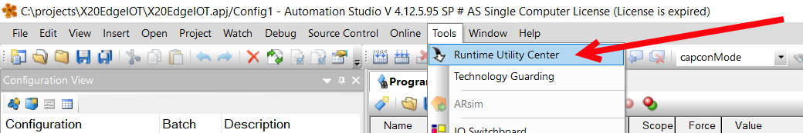
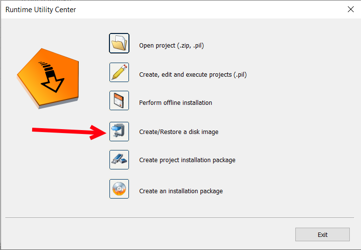
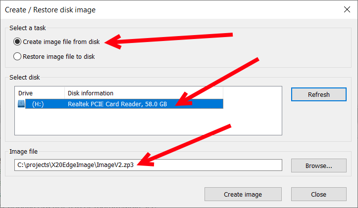
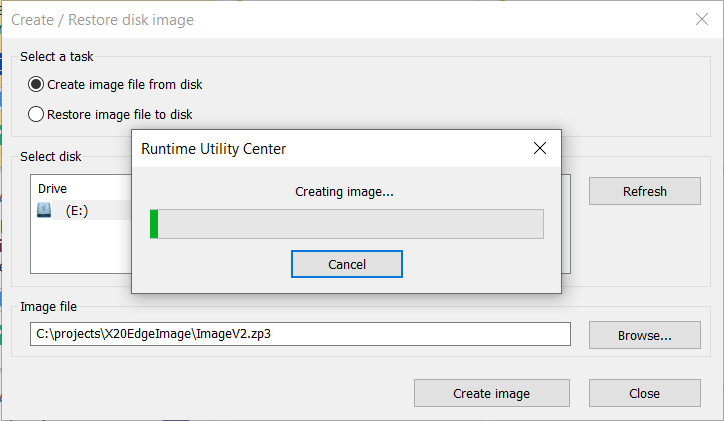
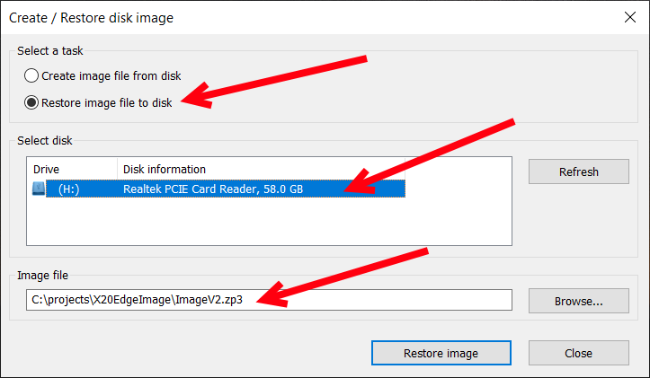

This guide shows how to use RUC but a lot of open source posibilities exist for example:

HDD Raw Copy Tool   (Clone & Write)
Rofus               (Write only)
Balena Etcher       (Write only)

# 🛠️ Cloning/burning new image

When you have an image on a X20 edge device that you now want to clone onto other X20 edge devices the easiest solution is to use Runtime Utility Center that comes installed with Automation Studio.

Here you can create and restore images to and from SD cards. 

## Save SD card image to file

#### 1. Open Runtime Utilty Center
The Runtime Utility Center can be opened from Automation Studio menu Tools->Runtime Utility Center.

#### 2. Select Create/Restore a disk image

#### 3. Select create image file from disk
Insert the SD Card you want to create a copy of. You will need an SD card reader if your computer does not have one. 
Select create image file from disk, select the disk and click Browse... and choose where the image should be placed on your computer.

Click create Image to start the process.

This process can take over an hour depending on SD card size.

## Load image file to SD card

#### 1. Open Runtime Utilty Center
The Runtime Utility Center can be opened from Automation Studio menu Tools->Runtime Utility Center.

#### 2. Select Create/Restore a disk image

#### 3. Select restore image file to disk
Insert the SD Card you want to load the image file to into the computer. You will need an SD card reader if your computer does not have one. 
Select restore image file from disk, select the disk and click Browse... and choose which image file you want to load onto the SD card.

Click Restore Image to start the process.

:::warning
All data that is on the SD card will be lost during this process.
:::

This process can take over an hour depending on SD card size.

