# Visualizing OPC-UA Data

## Introduction
In this workshop, we will collect data from an OPC UA server, store it in InfluxDB, and visualize it using Grafana. We will use Node-RED as the intermediary to read OPC UA data and push it to InfluxDB. By the end of this workshop, you will have a working IoT visualization setup running on your X20 Edge.

:::info

## Prerequisites

- Installed and configured Node-RED, InfluxDB, and Grafana in Docker [Grafana & InfluxDB Use Case](../use-cases/grafana.md), [Node-Red Use Case](../use-cases/node-red.md).
- Have access to an OPC UA server with readable data points.

:::

## Step 1: Connecting Node-RED to the OPC UA Server
1. Open Node-RED in your browser.
2. Install the OPC UA client node if not already installed:
   - Navigate to **Manage palette** (top-right menu) → **Install**.
   - Search for `node-red-contrib-opcua` and install it.

      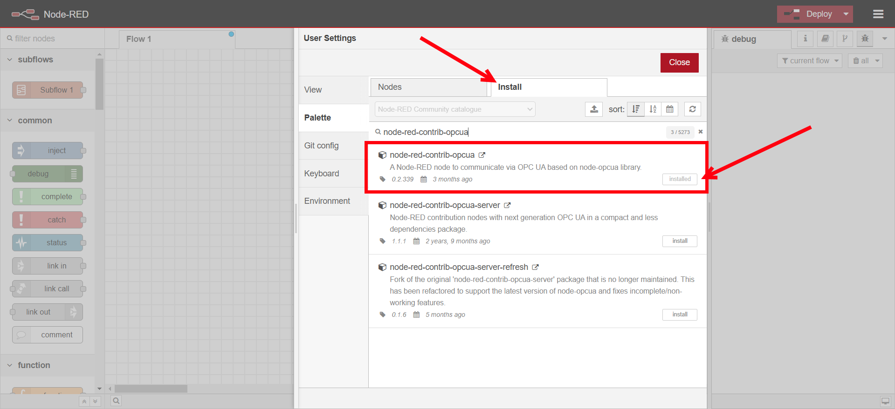
   - Search for `node-red-contrib-influxdb` and install it.

      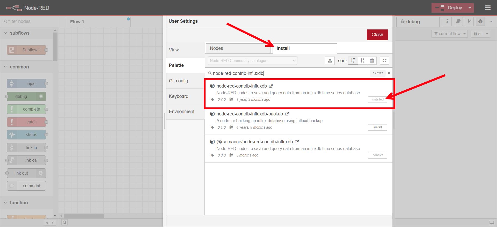
3. Drag an **OpcUa - Client** node into the flow.

   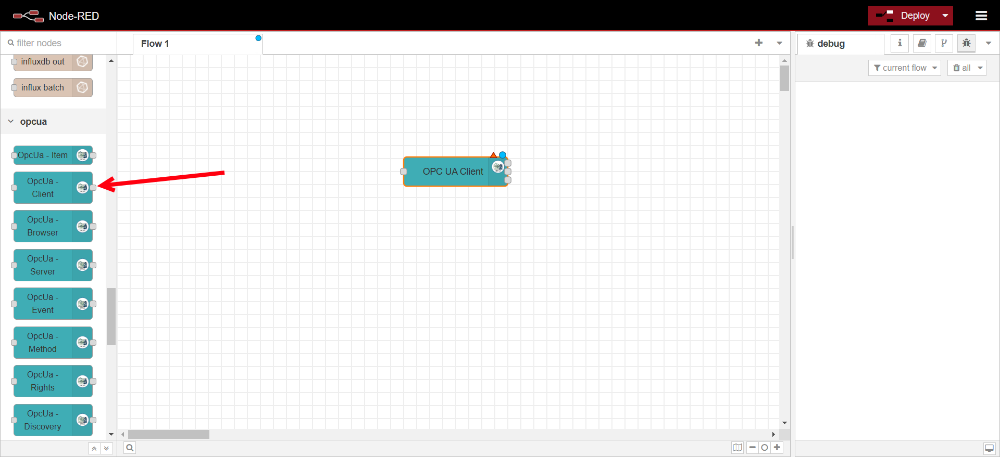
4. Configure the **OpcUa - Client** node:
   - Double-click the node to edit.
   - Set the **Endpoint** to your OPC UA server’s URL (e.g., `opc.tcp://192.168.x.x:4840`).
   - Change the Action to **SUBSCRIBE**.
   - Add authentication details if required.

   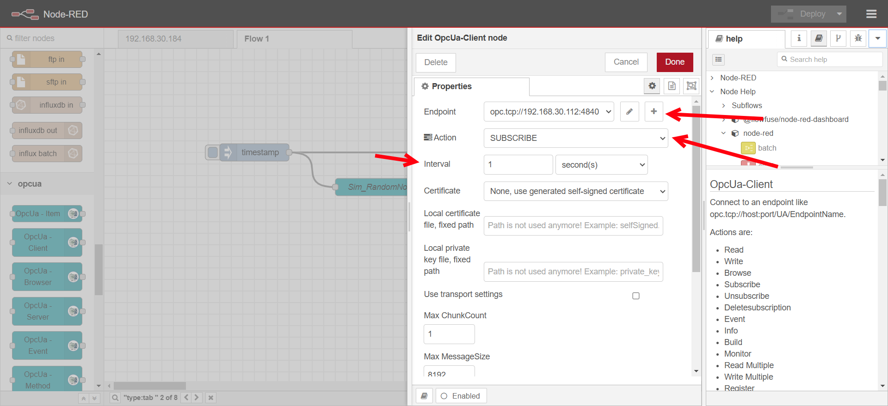

5. Drag an **OpcUa - Item** node into the flow.

6. Configure the **OpcUa - Item** node:
   - Double-click the node to edit.
   - Set the Item to `ns=6;s=::Program:Sim_RandomNoise` or other variable that is available on the OPC-UA test server.
   - Set the Type to Float for the Sim_RandomNoise or the appropriate datatype of the variable.
   - Set a name for the node.

   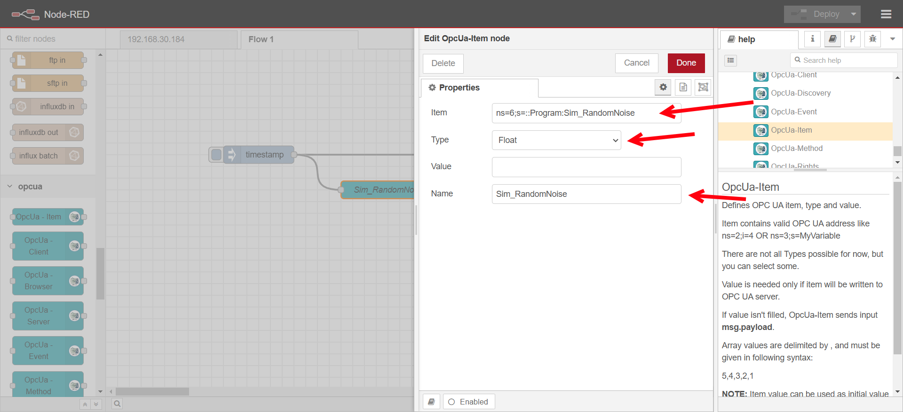

5. Drag an **inject node** to trigger data requests.
6. Drag a **debug node** to check the received data.
7. Connect the nodes and deploy the flow.

   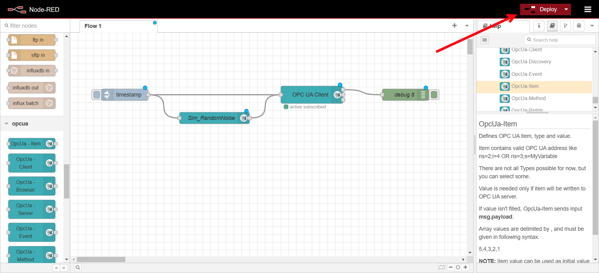
8. Verify that data is being received in the debug panel.

   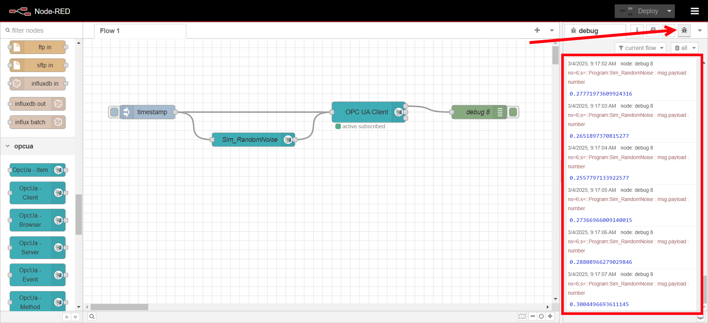

## Step 2: Storing Data in InfluxDB
1. Drag an **InfluxDB out** node into the flow.

   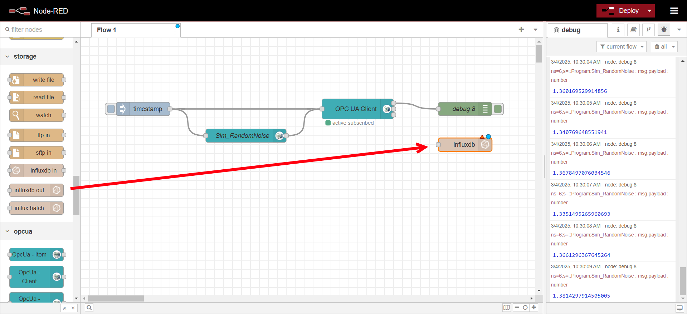
2. Configure InfluxDB:
   - Double-click the node to edit.
   - Click on the plus icon for creating a new server configuration

      

   - Change version to **2.0**, set URL to http://influxdb:8086, when running node-red inside the same docker compose stack as the InfluxDB database you can refer to it with the name of that services defined in the docker compose file. Set the Token to the value of INFLUX_TOKEN defined in the `.env` file in the compose stack. Untick verify 

      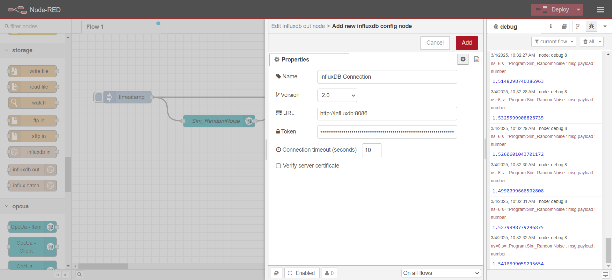
   - Define a measurement name (e.g., `sensor_data`).
      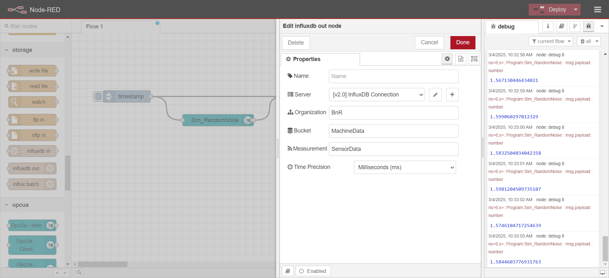

      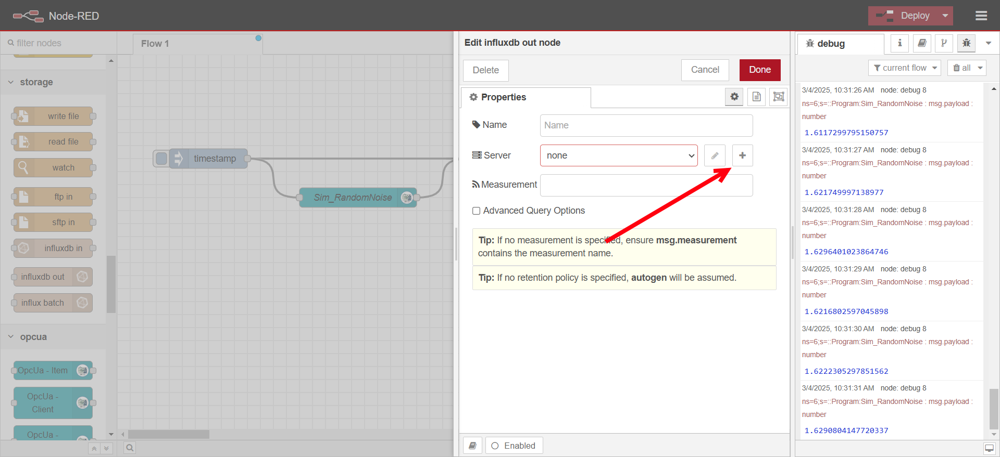

3. Drag a **function** node and connect it between the OPC UA Client and InfluxDB out node.

   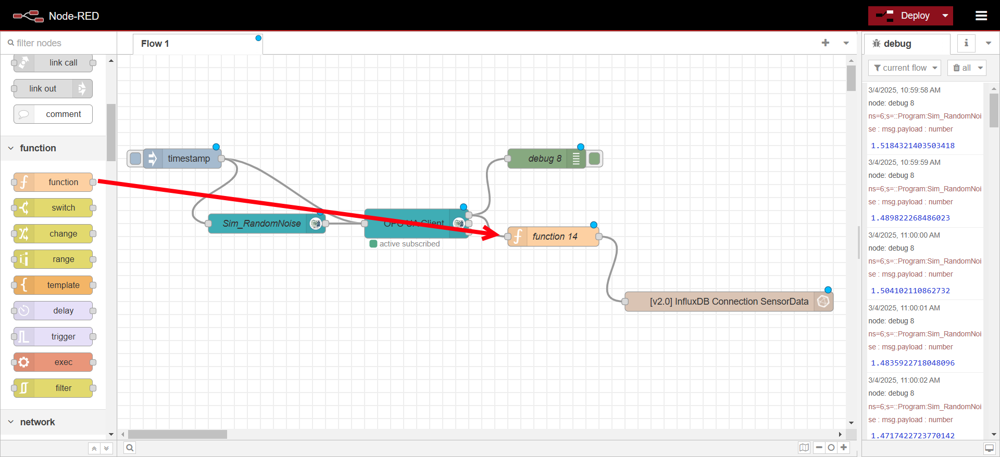

4. Configure function node
   - Paste the following code into On Message


   ```javascript
   // Extract necessary values from the message
   const fieldKey = msg.browseName;   // Use browseName as the field key
   const fieldValue = msg.payload;    // Use payload as the field value

   // Define fields (data values)
   const fields = {
      [fieldKey]: fieldValue
   };

   // Define tags (metadata)
   const tags = {
      ip: "192.168.30.112" // change this to the IP address of your OPC UA Server (PLC)
   };

   // Format the message for InfluxDB output node
   msg.payload = [fields, tags];

   return msg;
   ```

   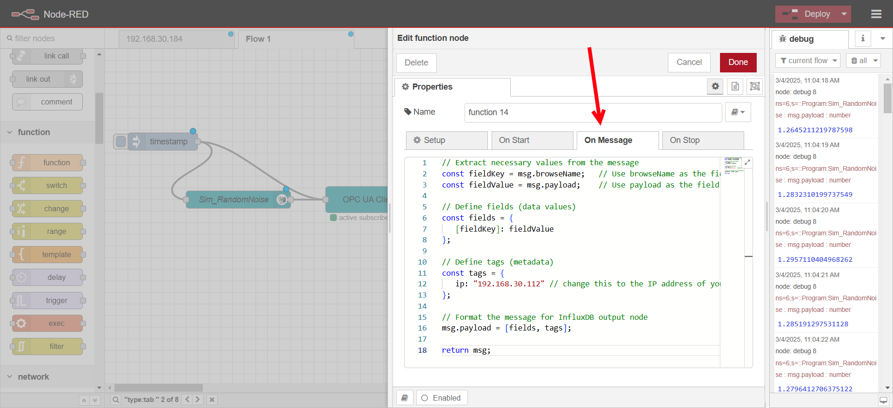
3. Deploy the changes, 

## Step 3: Visualizing Data in Grafana
1. Open Grafana in your browser at http://EDGEIP:3000. Use the username and password set in the `.env` file for your docker compose stack. If you followed the [Grafana & InfluxDB](../use-cases/grafana.md) Use case this will be the value of `GRAFANA_USERNAME` and `GRAFANA_PASSWORD`.

   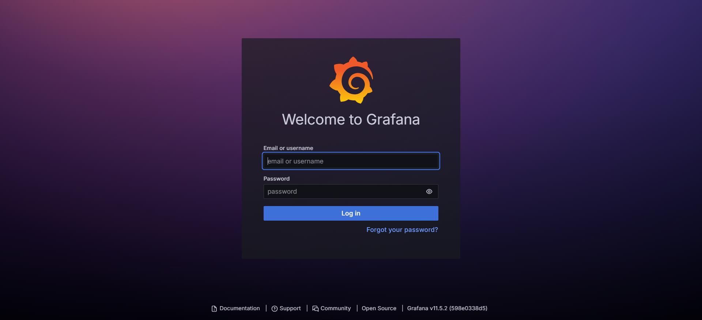

2. If you followed the [Grafana & InfluxDB](../use-cases/grafana.md) a connection from Grafana to the InfluxDB is automatically created, this can be found under **Connections->Data Sources**. The data source for InfluxDB can also be manually created by clicking the **Add new data source**.

   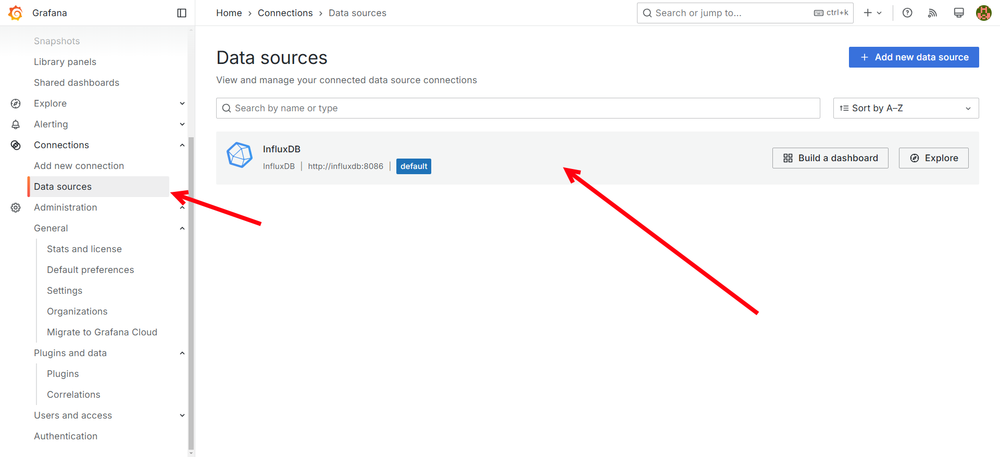
3. Create a new dashboard and panel:
   - Go to **Dashboards** → **New Dashboard**.

      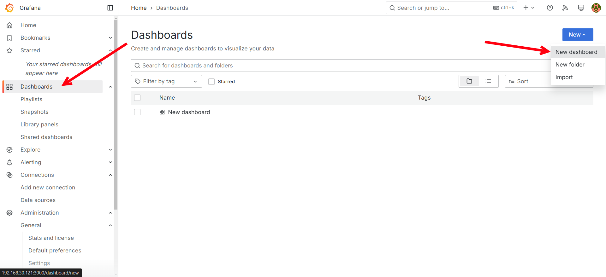
   - Add a new visualization.

      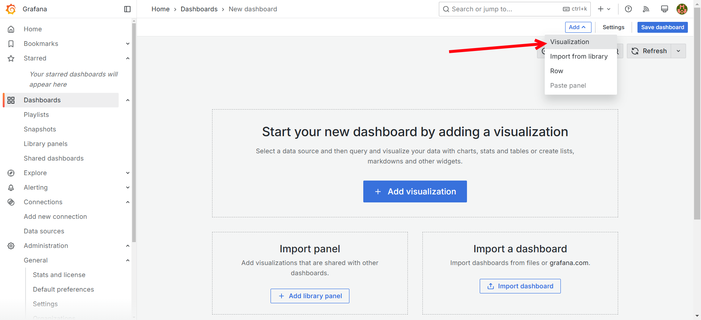
   - Select the InfluxDB Data source.

      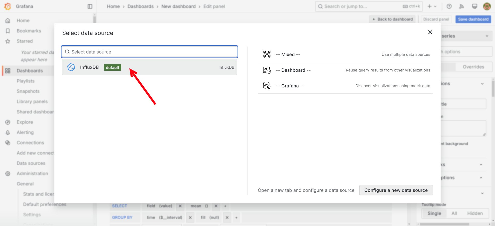
   - Setup the query to show the Sim_RandomNoise variable we created in Node-Red.
      
      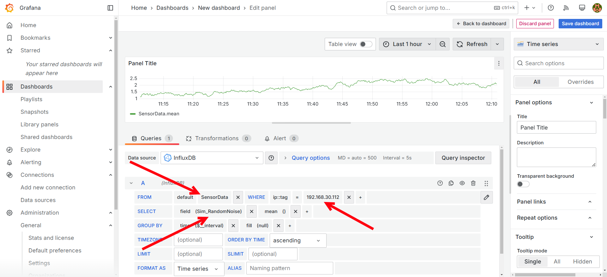

   - Save the dashboard and then go back to the dashboard.

      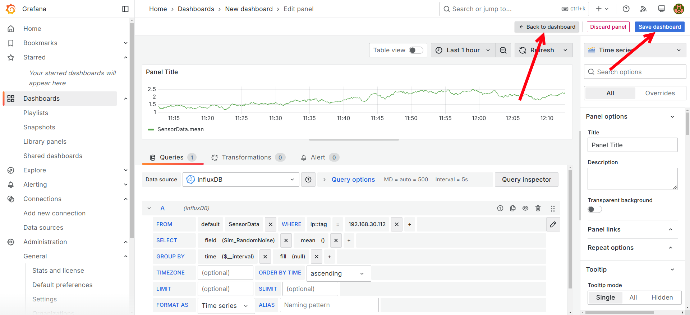

   - Set a refresh interval (e.g., 5s) to see live data updates.

      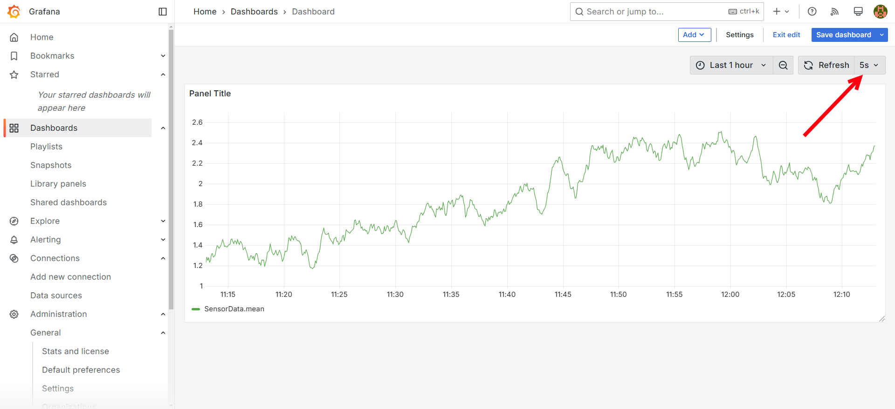

## Conclusion
You have successfully set up a real-time IoT data visualization pipeline using Node-RED, InfluxDB, and Grafana. This setup enables you to monitor OPC UA data from industrial devices efficiently.

## Next Steps
- Experiment with adding more variables to the subscription in Node-Red.
- Experiment with different visualization types in Grafana, this can be changed when editing a panel on the right side.

Happy experimenting!

