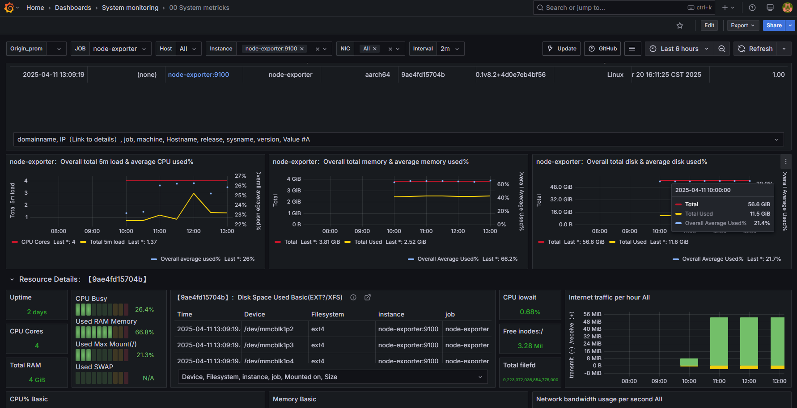
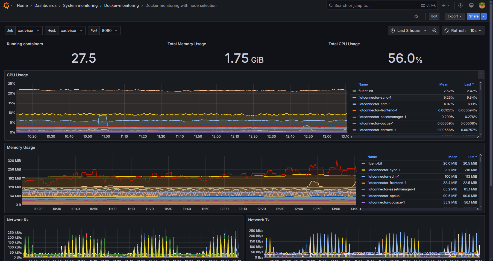
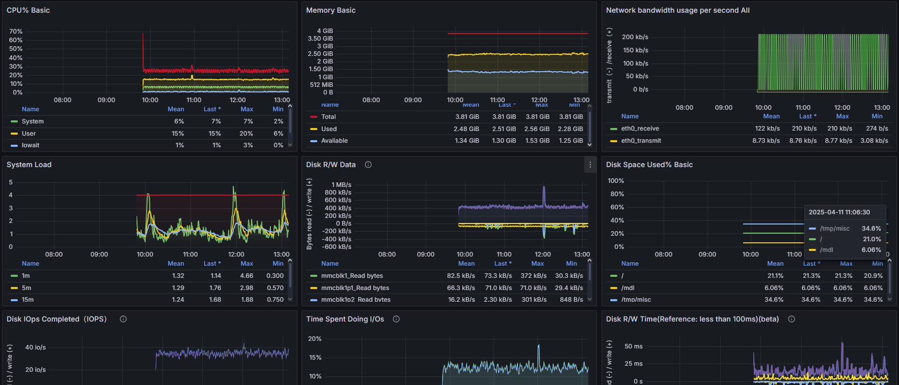
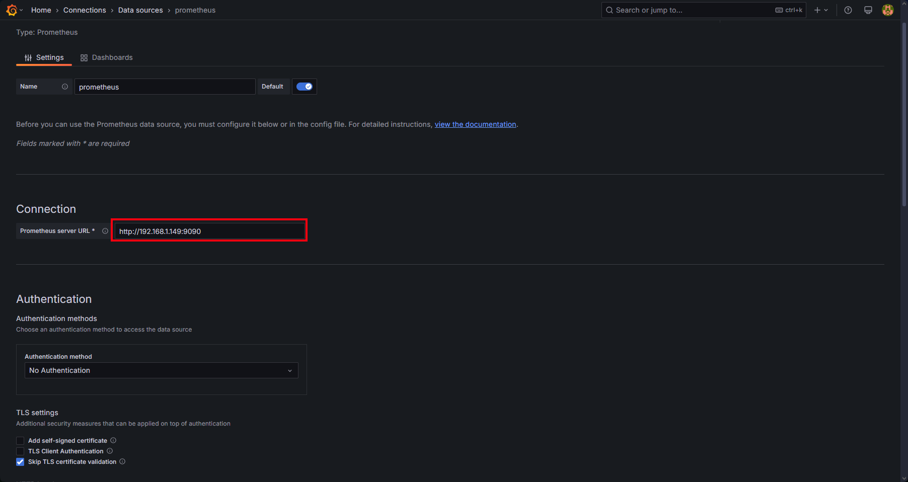
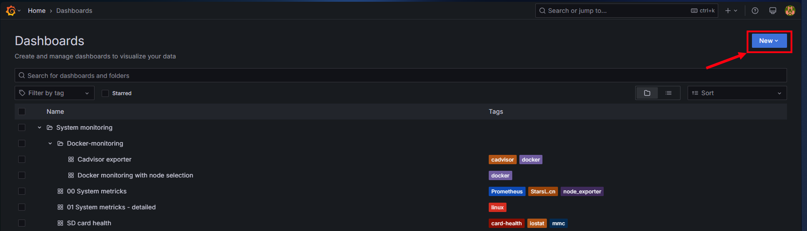
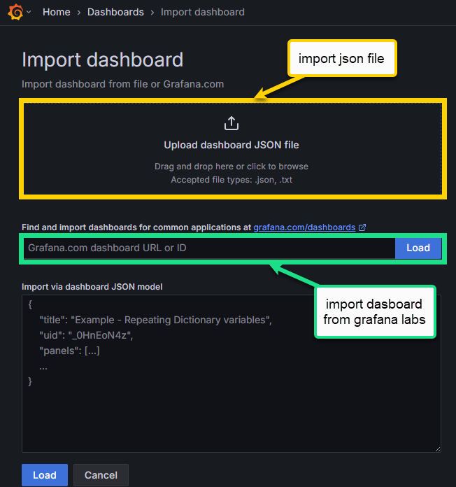

# 📊 Grafana Setup for Monitoring Stack

This guide explains how to configure **Grafana** to visualize data from your monitoring stack:

- Set up the **Prometheus datasource**
- Import dashboards from **Grafana Labs**
- Import a **custom SD card monitoring dashboard** from JSON

> ✅ Grafana may run **outside** this stack, but must have access Prometheus via `http://<host>:9090`.  




  
---

## 🔗 1. Add Prometheus Data Source

1. Open Grafana in your browser:  
   `http://<your-grafana-host>:3000`

2. Log in (default is `admin / admin` unless changed)

3. In the left menu, go to:  
   **⚙️ → Data Sources → Add data source**

4. Select **Prometheus**

5. Set the URL to:  
```nginx
http://<your-docker-host>:9090
```

6. Click **Save & Test**  


---

## 📥 2. Import Dashboards from Grafana Labs

### How to Import a Dashboard by ID:

1. In Grafana, go to **+ (Create) → Import**
2. Enter the dashboard ID (from the list below)
3. Click **Load**
4. Choose your Prometheus datasource
5. Click **Import**  
  

  

### Recommended Dashboard IDs:

| Dashboard Name                  | Grafana Labs ID |
|--------------------------------|------------------|
| Node Exporter Full             | 1860             |
| Docker Monitoring (cAdvisor)   | 11074            |
| Prometheus 2.0 Stats           | 4282             |
| Host Resource Usage (Node)     | 8321             |

> These dashboards provide detailed insights into your system, containers, and Prometheus itself.

---

## 📁 3. Import SD Card Monitoring Dashboard (from JSON)

You can use the included `grafana-dashboard.json` file to visualize metrics from the `sdcard-exporter`.  


### To Import:

1. Go to **+ (Create) → Import**
2. Click **Upload JSON file**
3. Select the file:  Monitoring/SDcardHealth/grafana-dashboard.json

4. Choose your Prometheus datasource
5. Click **Import**

---

## ✅ Result

You should now have a Grafana dashboard suite with:

- System-level stats (Node Exporter)
- Docker/container metrics (cAdvisor)
- Prometheus internal metrics
- SD card health stats from your custom exporter

You can now customize alerts, panels, and create a full monitoring UI.

---

## 🧩 Tips

- To make dashboards dynamic, use variables like `instance` or `job` in panel queries.
- You can set refresh intervals and time ranges at the top right of each dashboard.
- Exported dashboards can be versioned with Git for easy updates.
