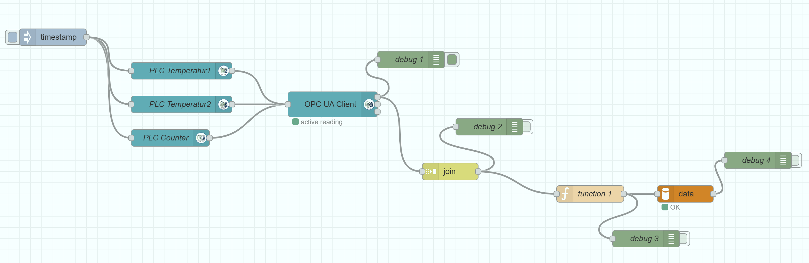

# 🔗 OPC UA to SQL data logger with node red

NodeRed is a flow-based programming tool for wiring together hardware devices, APIs, and online services. This sample connects to an OPC UA server, reads variable values, and logs them into a MySQL database using NodeRed.

For general information on setting up and using Node-RED with the X20 Edge Controller, please refer to the [Node-RED documentation](https://br-automation-com.github.io/X20-Edge-UseCases/docs/use-cases/node-red).

## Prerequisites

- NodeRed docker
- MySQL docker
- Pallette node-red-contrib-opcua
- Pallette node-red-node-mysql

## Installation

Open the text file 'opcua2sql.txt' from [**here**](https://github.com/br-automation-com/X20-Edge-UseCases/tree/main/NodeRed) and copy the content to your clipboard. Then, open Node-RED in your browser and import the flow by clicking on the menu icon (three horizontal lines) in the top right corner, selecting "Import," and pasting the copied content into the dialog box.

## Configuration

To run the sample as it is create a PLC project and add the following global variables: Temperatur1 (REAL), Temperatur2 (REAL) and Counter (UINT). Activate the variables in the OPC UA configuration in Automation Studio.
On the MySql server create a user 'admin' with the password 'bur'. Create a table with the name 'PLC' and the following columns: AsGlobalPV_Temperatur1 (FLOAT), AsGlobalPV_Temperatur2 (FLOAT) and AsGlobalPV_Counter (INT16).

To change the sample to your needs, follow these steps:

* Open the OPC UA client node and adjust the Endpoint
* Edit the variable nodes on the left side and adjust the variable names according to your needs. Make sure the namespace is correct. For AS 4.x this is ns=6; for AS 6.x it is ns=5.
* Edit the function node and adjust the variables in line 2-4. Adjust the INSERT statement in line 7.
* Edit the data node and adjust the connection parameters (host, user, password, database).

