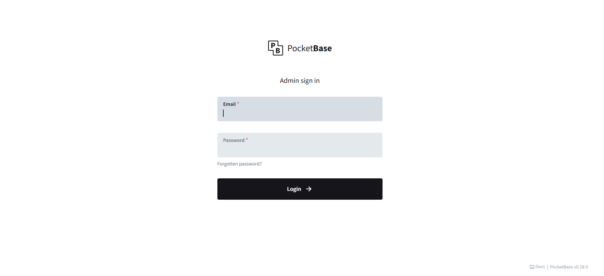
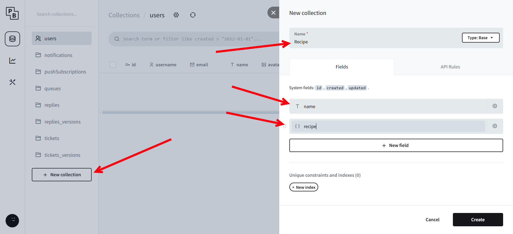
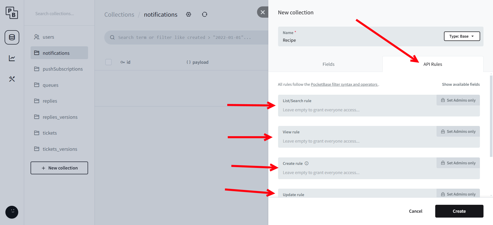
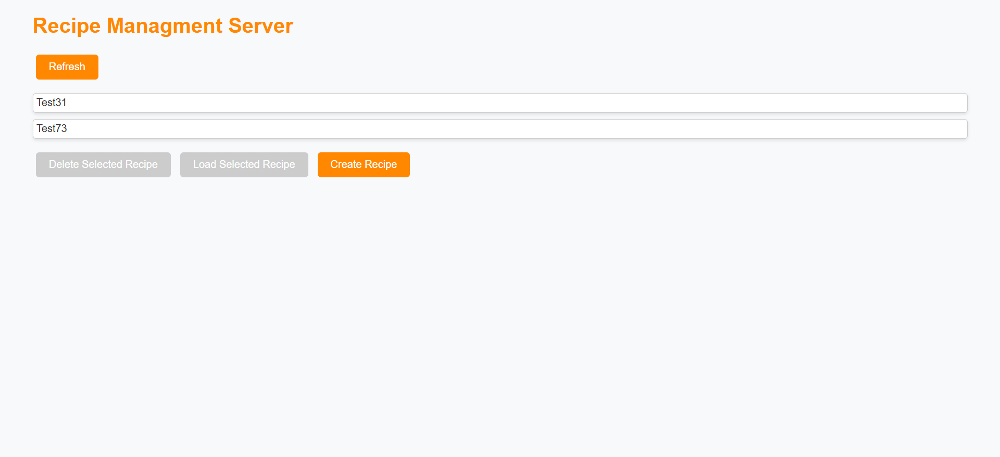

# 📜 Recipe Workshop

This guide provides step-by-step instructions for setting up and using the X20 Edge Recipe Management Server. The setup involves configuring Docker, PocketBase, and an OPC UA-enabled PLC to manage and manipulate recipes efficiently.

:::info

### Prerequisites

Before starting, ensure you have the following:

- **X20 Edge**
- **A PLC**
- **Internet access** via a LAN cable
- **GitHub Repository:** [X20 Edge Recipe Management Server](https://github.com/BRDK-GitHub/X20Edge-RecipeManagment)

:::

## Setup Process

### Step 1: Clone the GitHub Repository

1. SSH into the X20 Edge device with the configured user.
2. Navigate to the directory where you want to store the project.
3. Clone the repository:

   ```sh
   git clone https://github.com/BRDK-GitHub/X20Edge-RecipeManagment.git
   ```
4. Navigate into the cloned repository:

   ```sh
   cd X20Edge-RecipeManagment/docker
   ```

### Step 2: Deploy Docker Compose

1. Ensure you are inside the `docker` folder within the cloned repository.
2. Run the following command to start the services:

   ```sh
   docker compose up -d
   ```

### Step 3: Configure PocketBase

1. Open a web browser and navigate to `http://EdgeIP:8090/_/`.
2. Log in with the following credentials:
   - **Username:** `test@test.com`
   - **Password:** `1234567890`

   

3. Create a new **collection** named `Recipe`. Add two fields: name as Plan text and recipe as a JSON.

   

4. Assign appropriate permissions to allow data access. This is done by clicking on each of the rules.

   

### Step 4: Access the Web Interface

1. Open a web browser and go to `http://EdgeIP:8070`.

   
2. Click on **Create Recipe**.
3. You can now edit the recipe inside PocketBase or use its structure to create new ones.

## PLC Configuration

### Step 1: Enable OPC UA

1. Ensure OPC UA is enabled in the PLC settings.

### Step 2: Create a PLC Task

1. Create a **task** named `Main`.
2. Inside `Main`, define a structure named `recipe` with the following variables:
   - `Name` (string)
   - `Position` (real)
   - `Heat` (bool)
3. Enable all variables for OPC UA access.

## Summary

After following these steps, your X20 Edge should be running a recipe management system accessible via a web interface. The PLC can communicate with PocketBase through OPC UA, enabling real-time control and adjustments of recipes.

For additional support, visit the [GitHub repository](https://github.com/BRDK-GitHub/X20Edge-RecipeManagment).

