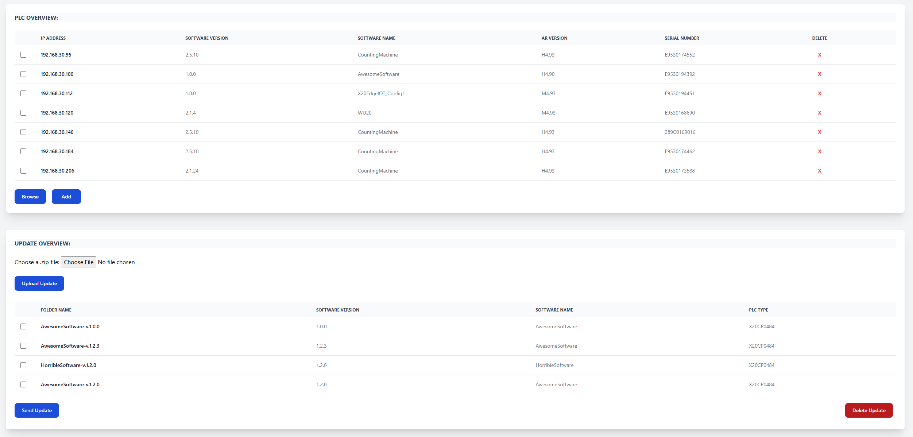

# 🚀 Deployment Workshop

Note: This workshop was conducted using B&RDK Github, which can be cloned from:

🔗 [GitHub Repository](https://github.com/BRDK-GitHub/X20Edge-SoftwareDeploymentServer)

The latest commit on the main branch now contains the complete solution, so some steps in the guide below may no longer be necessary.

## 1. Setup Web and FTP Server

### Create an `.env` file
Create an `.env` file and fill it with the necessary information. Use `example.env` as a reference.

#### Configure `docker-compose.yml`
In `docker-compose.yml`, set your environment variables using the syntax:

```yaml
{$ENVIRONMENT_VAR_NAME}
```

Read through the `docker-compose.yml` file and try to understand each line. Consider the following questions:
- ❓ What is the difference between the FTP and web container images?
- ❓  Why do we use volumes?

#### ▶️ Run the Containers
Run the following command in the terminal to start the containers:

```sh
docker-compose up
```

### 🌍 Interact with the Frontend
Once the containers are running, open the frontend in your browser at:

```
http://<EDGE_IP>:5000
```



####  Browse
Explore the available B&R PLCs on the network.

#### Add a New Device
Use the interface to add a new device by specifying its IP address.

#### Upload Updates
Upload updates from the `TestUpdates` folder.

#### Delete an Update
Remove an update using the frontend controls.

#### Send an Update to a PLC
Try sending an update to a PLC. Use the shared PLC with IP address:

```
192.168.30.100
```

---


## 2. Pull Updates in PLC

### Open the Automation Studio Project
Open the **Automation Studio 4.12** project located in the PLC directory.

### Connect to the PLC
The project is already downloaded. Open **monitor mode** on IP:

```
192.168.30.100
```

### Program Features
The program reads the current software version in **INIT** using `ArProjectGetInfo`. Additionally, it can:

- 📥 **Download Update** from the Edge FTP server to the PLC FTP server.
- 🔄 **Check Version** of the update on the PLC FTP server.
- 🚀 **Execute Update** on the PLC FTP server.

### Play Around with the Commands
Experiment with the different commands, but **NOTE:** Since we are sharing **one** PLC, you should only trigger a command if state = 10 (waiting state).

If you experience that state=222 it is an error state and can be cleared using **reset=TRUE** . It then return to state=10

---


## 3. Build Your Own OPC UA Image and Add It to `docker-compose`

### 📂 Locate the OPC UA Client
In the `OpcuaClient` directory, you will find the `opcuaclient.py` script, which polls and reads some nodes every 2 seconds. The nodes it will read are defined in `nodesToRead.json`. Your task is to **Dockerize** this OPC UA client.

### 📝 Create a Dockerfile
First, create a `Dockerfile` for the OPC UA client. You can look at the Dockerfile for the web server as inspiration. **Note:** Your `Dockerfile` needs to install `asyncua`, as this library is not included in Python by default:

```dockerfile
# Install required dependencies
RUN pip install asyncua
```

Try to figure out out the rest by yourself.

### 🔨 Build and Run the Docker Image

Navigate to the `OpcuaClient` directory and build the Docker image:

```sh
cd OpcuaClient
docker build -t opcua-client .
```

You can then run your newly created image:

```sh
docker run --rm opcua-client
```

> The `--rm` flag ensures the container is removed after it stops.

If everything works you should see the OPC UA nodes in the terminal.

### 🏗️ Add the Image to `docker-compose.yml`
Now, integrate the new Docker image into your `docker-compose.yml`. To do this:
1. Copy the existing `web:` container configuration.
2. Rename it to something like `opcuaclient:`.
3. Since the `Dockerfile` is **not** in the same directory as `docker-compose.yml`, modify the build section as follows:

```yaml
opcuaclient:
  build:
    context: ./OpcuaClient
    dockerfile: Dockerfile
```

Try to figure out the rest.

### ▶️ Run All Containers Together

Once everything is set up, start all three containers:

```sh
docker-compose up -d
```

🎉 **Enjoy your creation!** 😃
