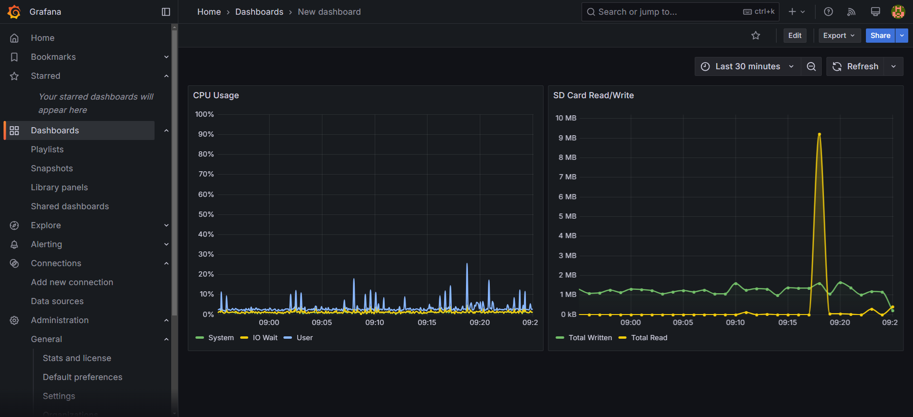
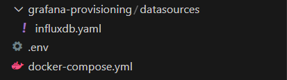
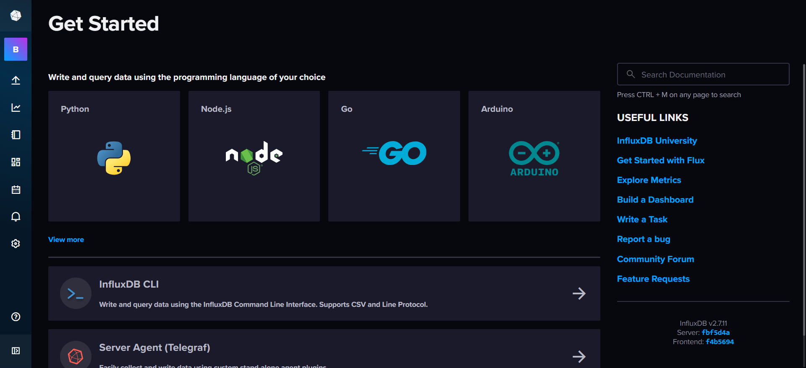

# Grafana & InfluxDB




## Introduction

In this guide, we will demonstrate how to set up Docker Compose for running Grafana and InfluxDB. We will define the necessary services and configurations to get your monitoring stack up and running in no time.

:::info

Before proceeding, ensure you have the following installed on your system, these come preinstalled on the X20 Edge:

- [Docker](https://docs.docker.com/get-docker/)
- [Docker Compose](https://docs.docker.com/compose/install/)

:::

## Docker Compose Configuration

Below is the ```docker-compose.yml``` configuration that you need to set up Grafana and InfluxDB services.

```yml title="docker-compose.yml"
services:
  influxdb:
    image: influxdb:2
    ports:
      - '8086:8086'
    volumes:
      - influxdb-storage:/var/lib/influxdb2
    environment:
      DOCKER_INFLUXDB_INIT_MODE: setup
      DOCKER_INFLUXDB_INIT_USERNAME: ${INFLUX_USERNAME}
      DOCKER_INFLUXDB_INIT_PASSWORD: ${INFLUX_PASSWORD}
      DOCKER_INFLUXDB_INIT_ORG: ${INFLUX_ORG}
      DOCKER_INFLUXDB_INIT_BUCKET: ${INFLUX_BUCKET}
      DOCKER_INFLUXDB_INIT_ADMIN_TOKEN: ${INFLUX_TOKEN} # Your predefined admin token
    restart: always
  grafana:
    image: grafana/grafana:latest
    ports:
      - '3000:3000'
    volumes:
      - grafana-storage:/var/lib/grafana
      - ./grafana-provisioning/:/etc/grafana/provisioning
    depends_on:
      - influxdb
    environment:
      - GF_SECURITY_ADMIN_USER=${GRAFANA_USERNAME}
      - GF_SECURITY_ADMIN_PASSWORD=${GRAFANA_PASSWORD}
      - DOCKER_INFLUXDB_INIT_ADMIN_TOKEN=${INFLUX_TOKEN} # Your predefined admin token
    restart: always
volumes:
  grafana-storage:
  influxdb-storage:
```

## Environment Variables

Ensure that you have the following environment variables defined:

- ```INFLUX_TOKEN```: Predefined admin token for InfluxDB.
- ```INFLUX_ORG```: Name of the organization.
- ```INFLUX_BUCKET```: Name of the InfluxDB bucket to be created.
- ```INFLUX_USERNAME```: Admin username for InfluxDB.
- ```INFLUX_PASSWORD```: Admin password for InfluxDB.
- ```GRAFANA_USERNAME```: Admin username for Grafana.
- ```GRAFANA_PASSWORD```: Admin password for Grafana.

You can set these variables in a ```.env``` file adjacent to your ```docker-compose.yml```:

```dotenv title=".env"
INFLUX_TOKEN=xk2z46zVIGSwZbT7UxbvXGYU87mRrvnQkD5rfDKoUfhTxud7zhPv1o1U5VuDwazS3QEqvE1Lih9Cp_5tsWd0Lg==
INFLUX_ORG=BnR
INFLUX_BUCKET=MachineData
INFLUX_USERNAME=admin
INFLUX_PASSWORD=adminadmin
GRAFANA_USERNAME=admin
GRAFANA_PASSWORD=adminadmin
```

## Setting Up

1. **Create the Docker Compose file**:

   Save the provided ```docker-compose.yml``` configuration to a file named ```docker-compose.yml```.

2. **Create the .env file**:

   Create a file named ```.env``` in the same directory as ```docker-compose.yml``` and add your environment variables.

3. **Create influxdb.yaml configuration file**

    Create a file named influxdb.yaml at the path grafana-provisioning/datasources/influxdb.yaml

    Add the following content to the file.

    ```yml title="grafana-provisioning/datasources/influxdb.yaml"
    apiVersion: 1
    datasources:
      - name: InfluxDB
        type: influxdb
        access: proxy
        url: http://influxdb:8086
        isDefault: true
        jsonData:
          httpHeaderName1: Authorization
        secureJsonData:
          httpHeaderValue1: Token ${DOCKER_INFLUXDB_INIT_ADMIN_TOKEN}
          password: adminadmin
        database: MachineData
        user: admin
        basicAuth: false
        editable: true
    ```

3. **Run Docker Compose**:

    Now your folder should look like this:

    

   Execute the following command to start the services:
   ```shell
   docker-compose up -d
   ```

   This will download the necessary images, create the containers, and start the services.

## Accessing Grafana and InfluxDB

- **Grafana**: Navigate to [http://ip-address:3000](http://ip-address:3000) in your web browser. Log in with the credentials specified in your ```.env``` file.

- **InfluxDB**: Navigate to [http://ip-address:8086](http://ip-address:8086).



## Conclusion

You have successfully set up Grafana and InfluxDB using Docker Compose.

_For more details on configuring Grafana and InfluxDB, refer to their official documentation._

---

