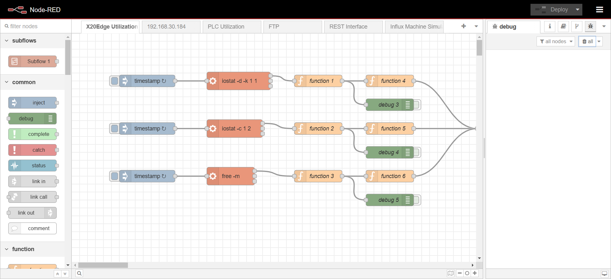

# Node-RED

This tutorial will guide you through setting up Node-RED using Docker Compose.



:::info

Before proceeding, ensure you have the following installed on your system, these come preinstalled on the X20 Edge:

- [Docker](https://docs.docker.com/get-docker/)
- [Docker Compose](https://docs.docker.com/compose/install/)

:::

## Step 1: Create a Docker Compose File

Create a directory for your Node-RED setup and navigate into it:

```sh
mkdir node-red && cd node-red
```

Create a `docker-compose.yml` file:

```yaml
services:
  node-red:
    image: nodered/node-red:latest
    container_name: node-red
    restart: unless-stopped
    ports:
      - "1880:1880"
    volumes:
      - node_red_data:/data
    environment:
      - TZ=Europe/Copenhagen

volumes:
  node_red_data:
```

## Step 2: Start the Container

Run the following command to start Node-RED:

```sh
docker-compose up -d
```

This will pull the latest Node-RED image, create the container, and start it in detached mode.

## Step 3: Access Node-RED

Once the container is running, open your browser and go to:

```
http://<X20-Edge-IP>:1880
```

## Step 4: Persisting Data

The `volumes` section in `docker-compose.yml` now defines a named volume `node_red_data`, ensuring that flows and configurations persist across container recreations.

## Step 5: Stopping and Removing the Container

To stop Node-RED, use:

```sh
docker-compose down
```

This will stop and remove the container while preserving the named volume `node_red_data`.

## Conclusion

You have successfully set up Node-RED using Docker Compose with a named volume. You can now start creating and deploying your flows!
