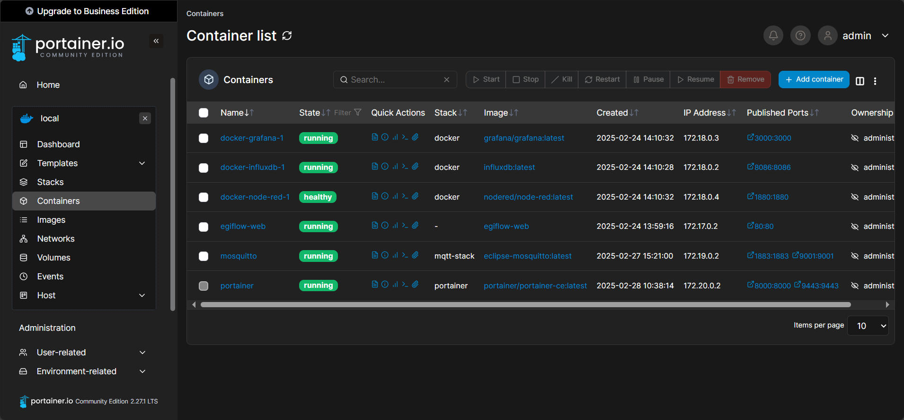
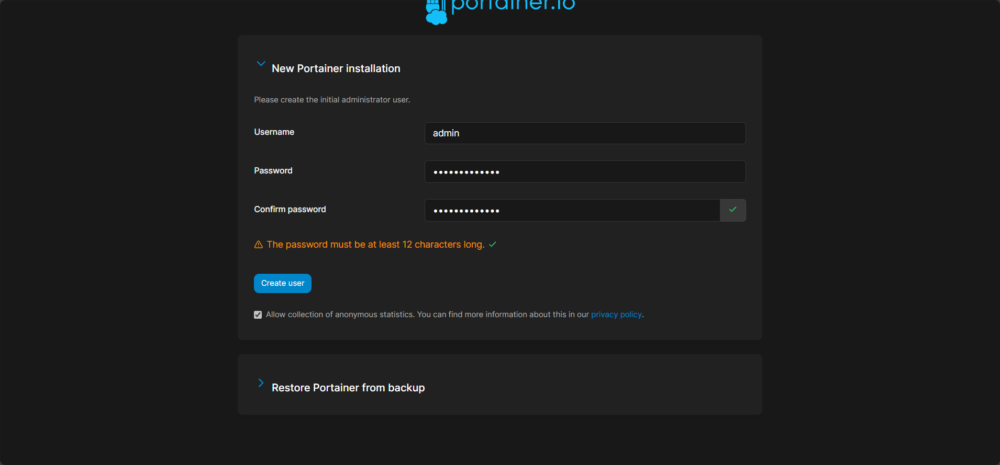
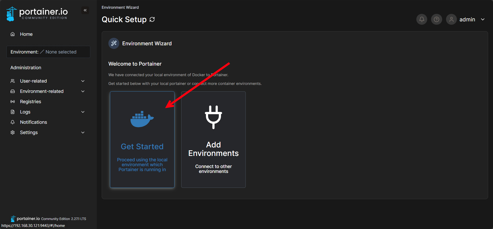
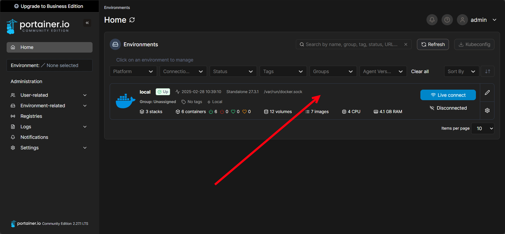
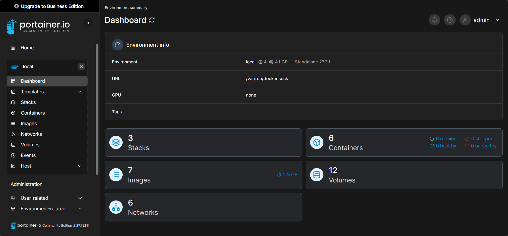

# Portainer



## Introduction
Portainer is a powerful container management tool that provides an intuitive UI for managing Docker environments. This guide walks you through setting up Portainer using Docker Compose.

:::info

Before proceeding, ensure you have the following installed on your system, these come preinstalled on the X20 Edge:

- [Docker](https://docs.docker.com/get-docker/)
- [Docker Compose](https://docs.docker.com/compose/install/)

:::

## Step 1: Create a Docker Compose File
Create a `docker-compose.yml` file with the following content:

```yaml
services:
  portainer:
    image: portainer/portainer-ce:latest
    container_name: portainer
    restart: always
    ports:
      - "8000:8000"
      - "9443:9443"
    volumes:
      - /var/run/docker.sock:/var/run/docker.sock
      - portainer_data:/data
    environment:
      - TZ=UTC  # Set timezone if needed

volumes:
  portainer_data:
```

## Step 2: Deploy Portainer
Navigate to the directory where you saved `docker-compose.yml` and run the following command:

```sh
docker-compose up -d
```

This command will pull the latest Portainer image, create a container, and start it in detached mode.

## Step 3: Access the Portainer UI
Once the container is running, open your browser and go to:

```
https://<X20-Edge-IP>:9443
```

The first time you access Portainer, you will be prompted to create an admin user.



## Step 4: Connect to Docker Environment
After setting up the admin account:
1. Select **Get Started** to select the local docker environment running on the X20 Edge.

    

2. Click on the **local** environment to manage the local docker environment on the X20 Edge.

    

    On the dashboard it is possible to see number of compose stacks, containers, images, volumes and networks. By clicking on them will open other pages to view more information about the individual items.

    

## Managing Portainer
To stop and remove the Portainer container, use:

```sh
docker-compose down
```

To update Portainer to the latest version:

```sh
docker-compose pull

docker-compose up -d
```

## Conclusion
You have successfully deployed Portainer using Docker Compose. Now you can efficiently manage your Docker containers via a web-based UI.

For further customization, refer to the [Portainer documentation](https://docs.portainer.io/).

