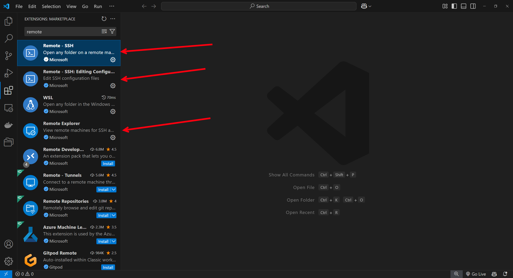
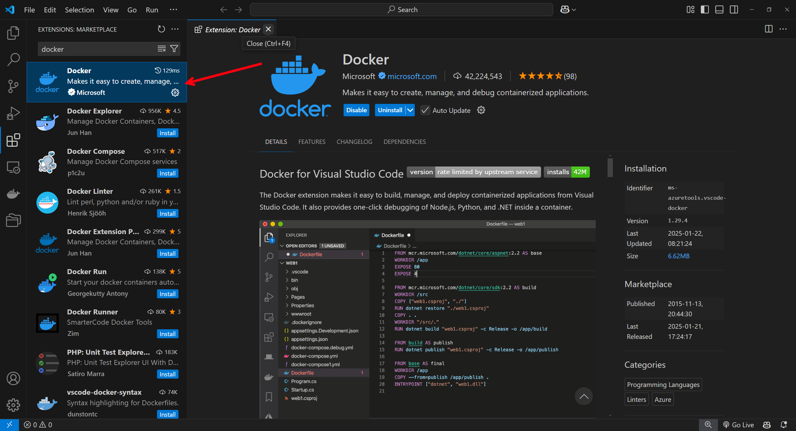
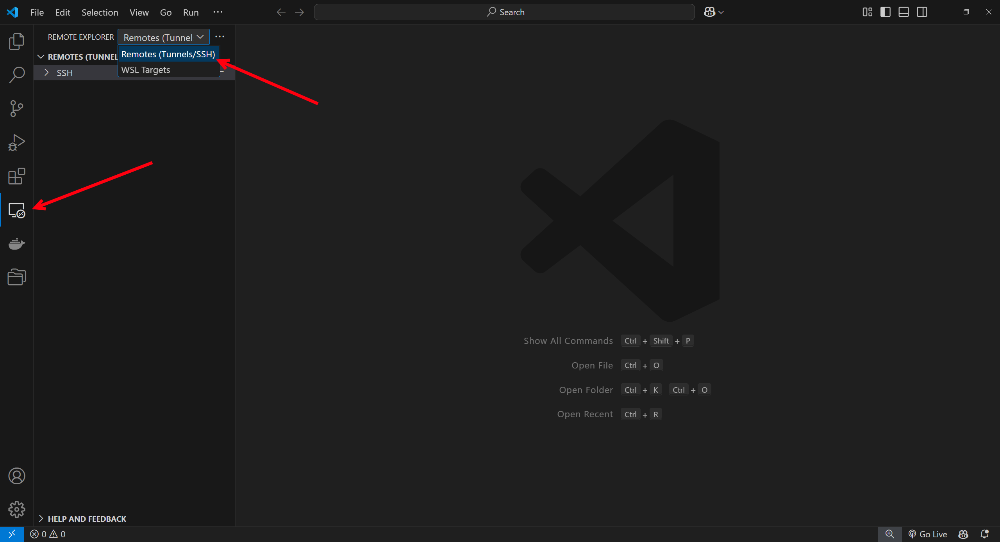
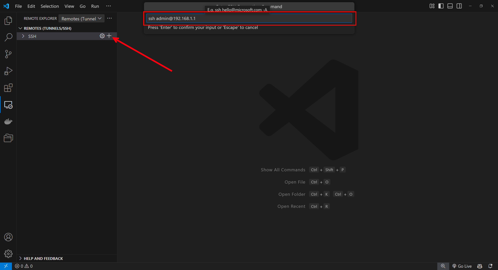
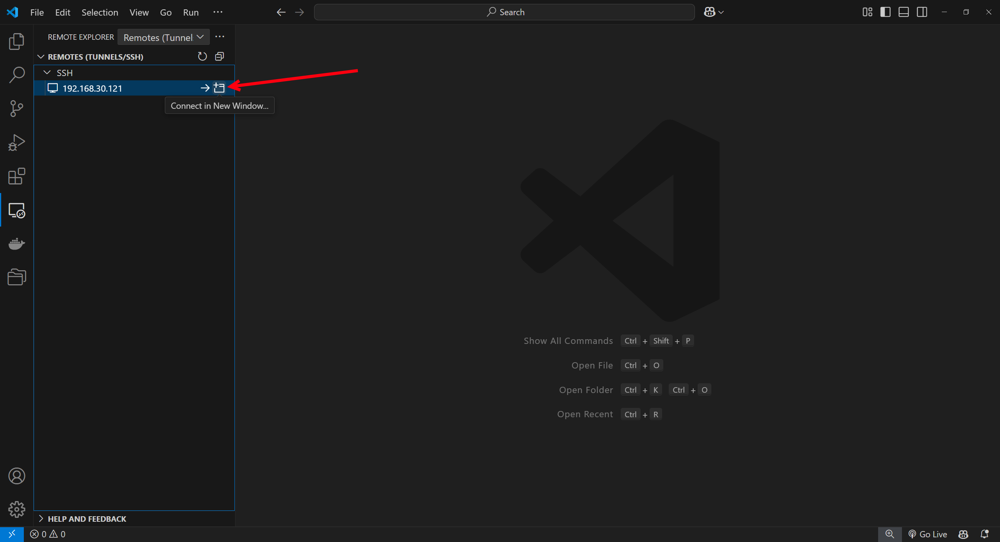
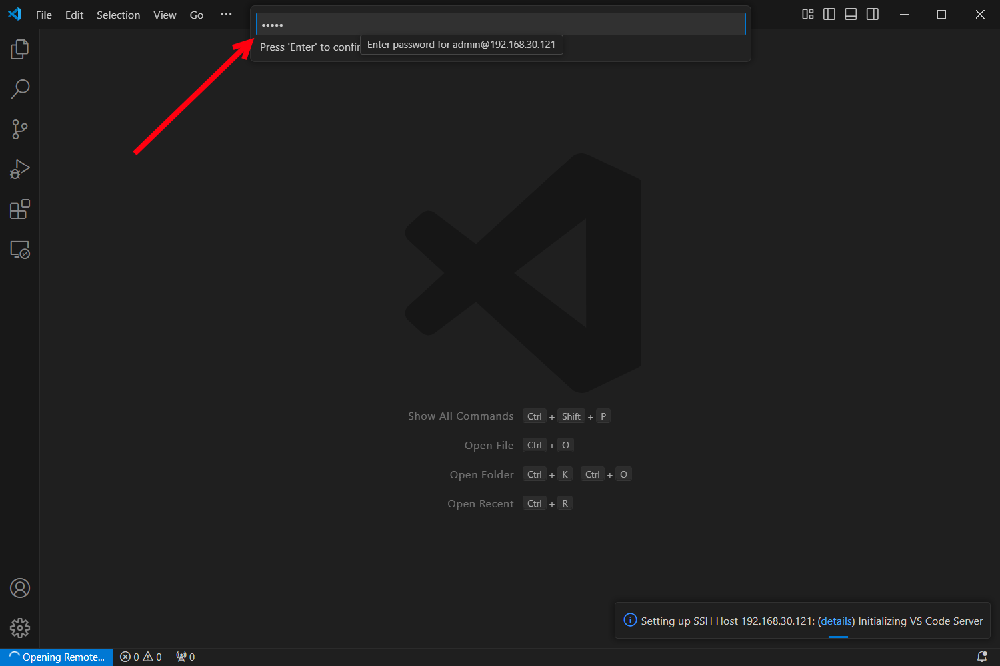
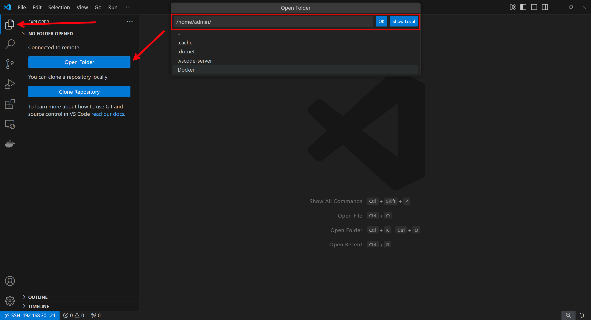
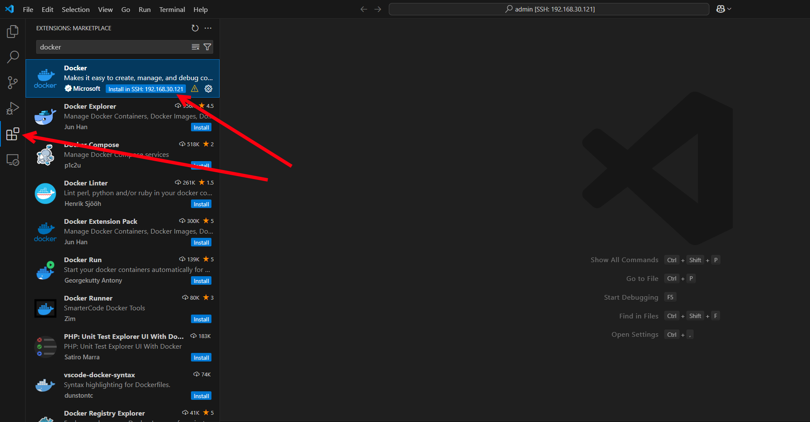
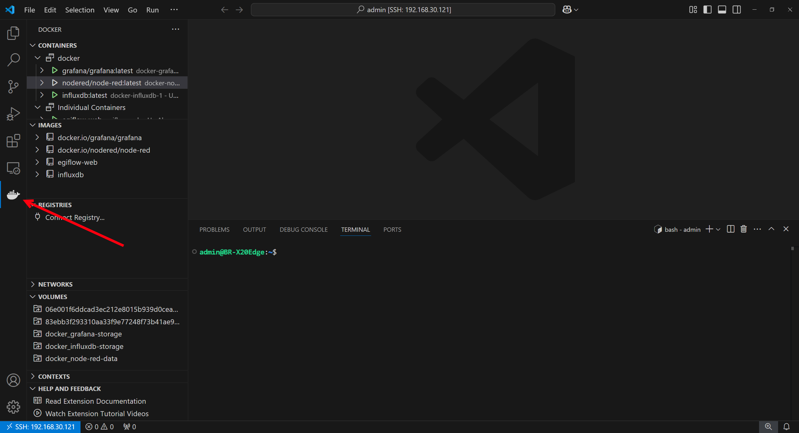
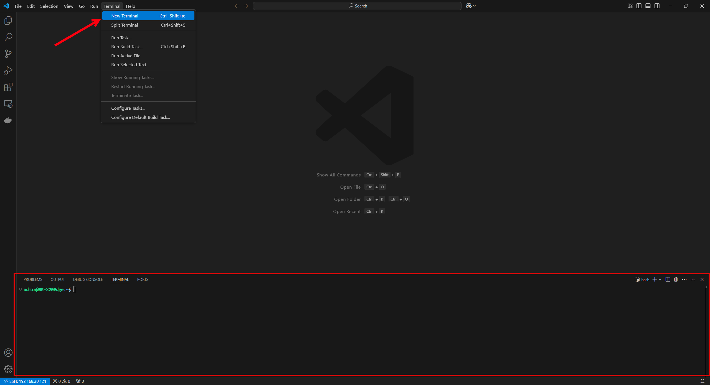

# 💻 VS Code Remote Development

## Introduction

This tutorial will guide you through the process of installing Visual Studio Code, setting up the Remote - SSH extension, and connecting to a remote B&R Automation X20 Edge device.

## Step 1: Installing Visual Studio Code

1. **Download VS Code**  
   Go to the [Visual Studio Code website](https://code.visualstudio.com/) and download the version suitable for your operating system (Windows, macOS, or Linux).

2. **Install VS Code**  
   Follow the installation instructions for your specific operating system. For Windows, this generally involves running the downloaded installer. For macOS and Linux, follow the respective setup instructions.

## Step 2: Installing the Remote - SSH Extension

1. **Open VS Code**  
   Launch Visual Studio Code after installation.

2. **Install extensions**  
    Click on the Extensions icon in the Activity Bar on the side of the window or press ```Ctrl+Shift+X``` to open the Extensions view.
    
    Install the following remote extensions:

    

    Install the docker extension:

    

## Step 3: Connecting to a X20 Edge Device

1. **Open Remote Explorer**  
   In the Activity Bar, click on the Remote Explorer icon. This is usually a monitor icon with a connector.

   

2. **Add a New SSH Target**  
   Click on the ```+``` button next to ```SSH Targets```, or use the ```Add New``` option.

   

    Enter the SSH connection details for your X20 Edge device. The format should be:  
   ```ssh <user>@<hostname>```  
   For example:  
   ```ssh admin@192.168.1.1```

4. **Configure SSH**  
   VS Code will prompt you to select the SSH configuration file to save the new connection. Choose the appropriate file (```~/.ssh/config``` on Linux/macOS or ```C:\Users\<your-username>\.ssh\config``` on Windows).

   After this step, you might be asked to select the SSH key file or to enter your password if you have not set up key-based authentication.

5. **Connect to the Device**  
   After adding the SSH target, click on the newly added target from the Remote Explorer list to initiate the connection.

   

    Enter the password of the user.

   

6. **Open Folder on Remote**  
   Once connected, you can click on the file icon shown with the red arrow and then click Open Folder and select the folder on the X20 Edge you want to view.

   

7. **View Docker containers and images**
   To view docker containers running on the X20 edge you can install the docker extension. This has to be done after connecting to the device as described in step 5.

   

   You can click on the docker icon in the left menu bar to view running containers and available images.

   

   Right clicking on a container gives you the option to view logs from that container and attach a shell to get terminal access into that container for debugging.

8. **Open terminal**
   You can open a SSH terminal on the X20 edge by clicking on Terminal->New Terminal.

   

## Conclusion

You have now successfully installed Visual Studio Code, set up the Remote - SSH extension, and connected to your B&R Automation X20 Edge device. You can now begin developing and managing your PLC programs remotely.

For more information and advanced configurations, refer to the [Remote - SSH documentation](https://code.visualstudio.com/docs/remote/ssh) and the [B&R Automation documentation](https://www.br-automation.com/en/).
